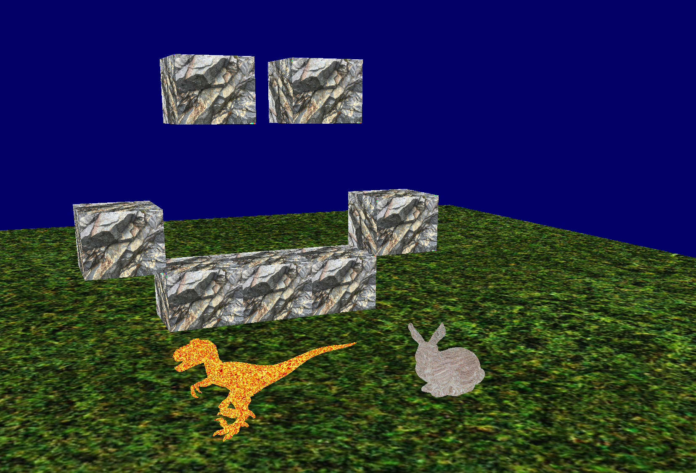

<div align="center">

# OpenGL - 3D Scene

3D environment that serves as backbone of an game engine.



</div>

## Features

- Freely moving camera
- Scene abstraction where you can
    - Render .obj files and cubes with
        - Textures and colors
        - Translation, rotation and scale
- Easily extendable architecture

## Run the demo:

Install build dependencies
- Ubuntu/Debian: `apt install build-essential cmake libglm-dev libsdl2-dev libglew-dev`
- Arch Linux: `pacman -S base-devel cmake glm sdl2 glew`

```
git clone https://github.com/viirret/OpenGL-Demo.git
cd OpenGL-Demo
mkdir build && cd build
cmake ..
make
./opengl-demo
```

## Licence

The code in this project is licenced under [MIT](LICENCE) license. Assets are proprietary.